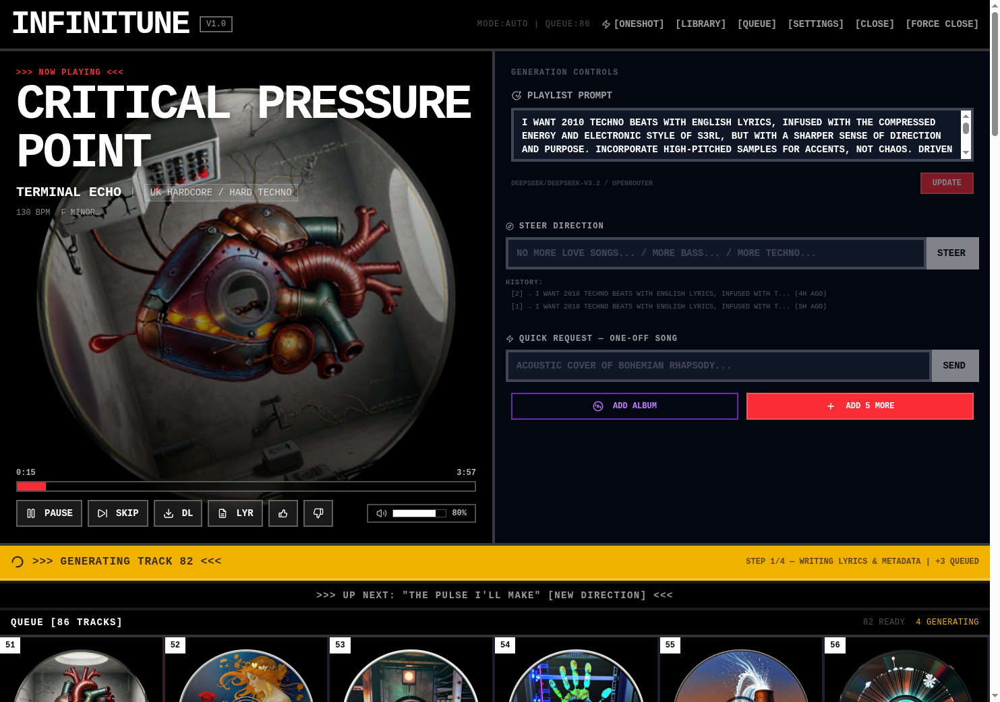
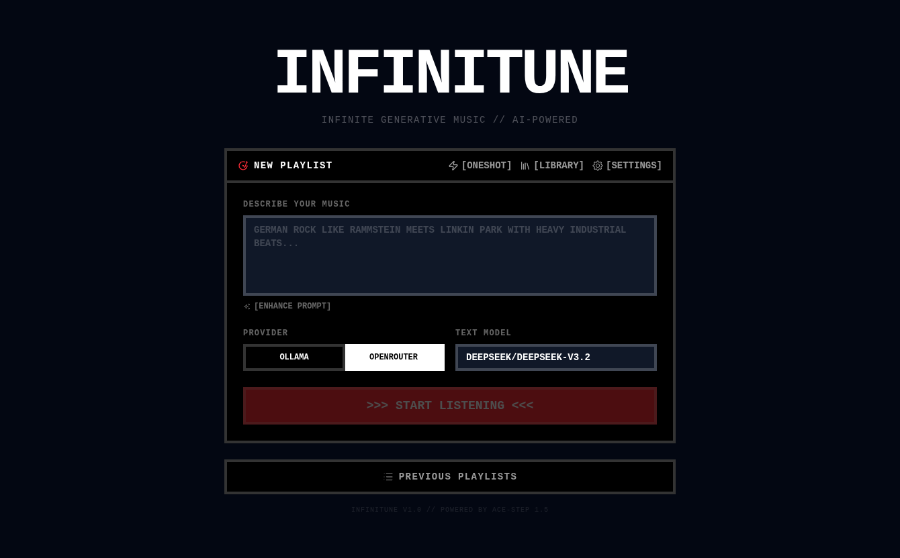
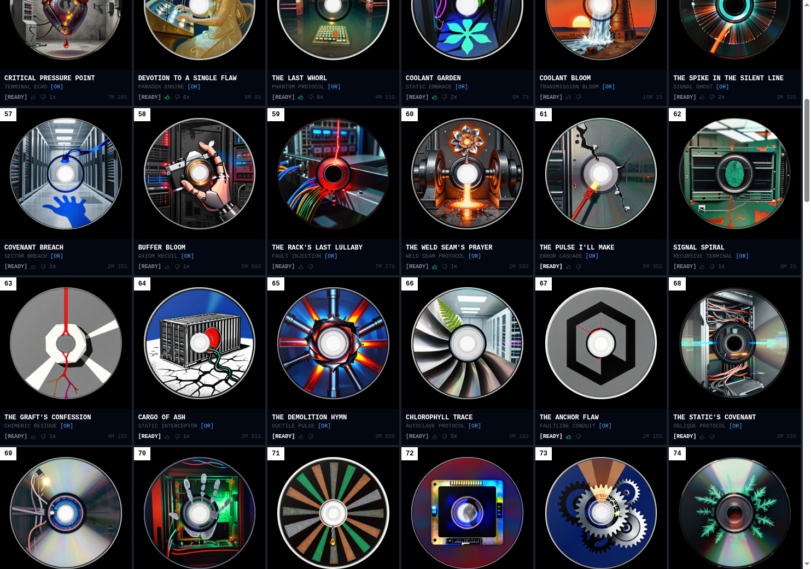

<div align="center">

# INFINITUNE

**Infinite generative music — describe a vibe, get an endless stream of original songs.**

Lyrics, cover art, and audio are all generated on the fly by AI.



</div>

---

## Screenshots

| Playlist Creator | Queue Grid |
|:---:|:---:|
|  |  |

## How It Works

1. **Describe your music** — type a prompt like *"2010 techno beats with English lyrics, S3RL energy, heavy 808 bass"*
2. **Hit Start** — a background worker begins generating songs in a pipeline: LLM writes metadata + lyrics → ComfyUI renders cover art → ACE-Step synthesizes audio
3. **Listen endlessly** — songs appear in real-time as they're generated. Rate them (thumbs up/down) to steer the direction. Request one-offs or generate entire albums from a single track.

## Hardware Setup

Infinitune runs on a **Framework Desktop** (AMD Ryzen / dedicated GPU) hosting the AI services locally:

| Service | Role | Details |
|---------|------|---------|
| **ACE-Step 1.5** | Audio generation | Text-to-music model, generates full songs from lyrics + captions |
| **Ollama** | Local LLM | Runs models like Llama 3.1 for writing song metadata, lyrics, and persona extraction |
| **OpenRouter** | Cloud LLM (optional) | Alternative to Ollama — access DeepSeek, Claude, GPT, etc. via API |
| **ComfyUI** | Cover art generation | Generates vinyl-style album covers from image prompts |
| **Convex** | Real-time database | Syncs playlist state between browser, worker, and all connected clients |

All services run on the local network. The browser connects to Convex (cloud-hosted), which the worker polls for pending songs.

## Tech Stack

| Layer | Technology |
|-------|-----------|
| Frontend | React 19, TanStack Router, Tailwind CSS 4 |
| Backend | Convex (real-time DB + mutations/queries) |
| Worker | Node.js background process with per-song workers and endpoint queues |
| Audio | ACE-Step 1.5 (text-to-music synthesis) |
| Cover Art | ComfyUI (image generation) |
| LLM | Ollama (local) or OpenRouter (cloud) |
| Build | Vite 7, TypeScript 5.7, Biome (lint/format) |

## Quick Start

```bash
# Install dependencies
pnpm install

# Start Convex backend
npx convex dev

# Start dev server
pnpm dev

# Start the generation worker
pnpm worker
```

Configure service URLs in the Settings page (`/autoplayer/settings`) or via environment variables.

## Environment Variables

Configure in `.env.local` or export in your shell:

| Variable | Default | Description |
|----------|---------|-------------|
| `VITE_CONVEX_URL` | — | Convex deployment URL (required) |
| `OLLAMA_URL` | `http://192.168.10.120:11434` | Ollama API endpoint |
| `ACE_STEP_URL` | `http://192.168.10.120:8001` | ACE-Step audio generation endpoint |
| `COMFYUI_URL` | `http://192.168.10.120:8188` | ComfyUI image generation endpoint |
| `OPENROUTER_API_KEY` | — | OpenRouter API key (if using cloud LLM) |
| `MUSIC_STORAGE_PATH` | `/mnt/truenas/MediaBiB/media/AI-Music` | Path for storing generated audio files |
| `ACE_NAS_PREFIX` | — | NAS path prefix for ACE-Step output |

Most settings can also be configured live via the Settings page.

## Architecture

```
Browser (React + TanStack Router)
  ↕ real-time sync
Convex (database + API)
  ↕ polling
Worker (background process)
  ├── LLM → song metadata + lyrics
  ├── ComfyUI → cover art
  └── ACE-Step → audio generation
```

The frontend creates playlists and displays songs in real-time. The worker polls Convex for pending songs, orchestrates the generation pipeline (LLM → cover art → audio), and writes results back. Convex's real-time subscriptions push updates to the browser instantly.

## Project Structure

```
src/
  routes/          # File-based routes + API endpoints
  components/      # React components
  services/        # LLM, ACE-Step, cover art integrations
  hooks/           # Custom React hooks
  lib/             # Utilities
convex/            # Database schema, mutations, queries
worker/            # Background song generation worker
public/
  screenshots/     # App screenshots for README
```
