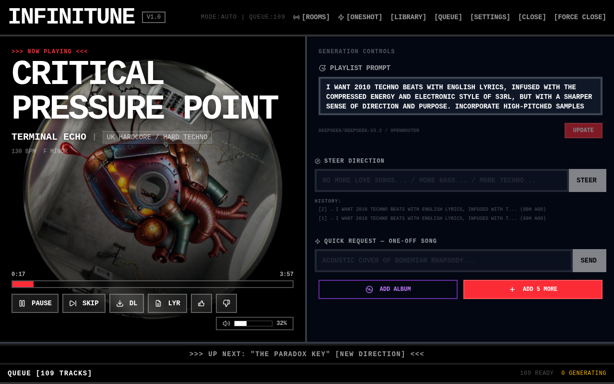
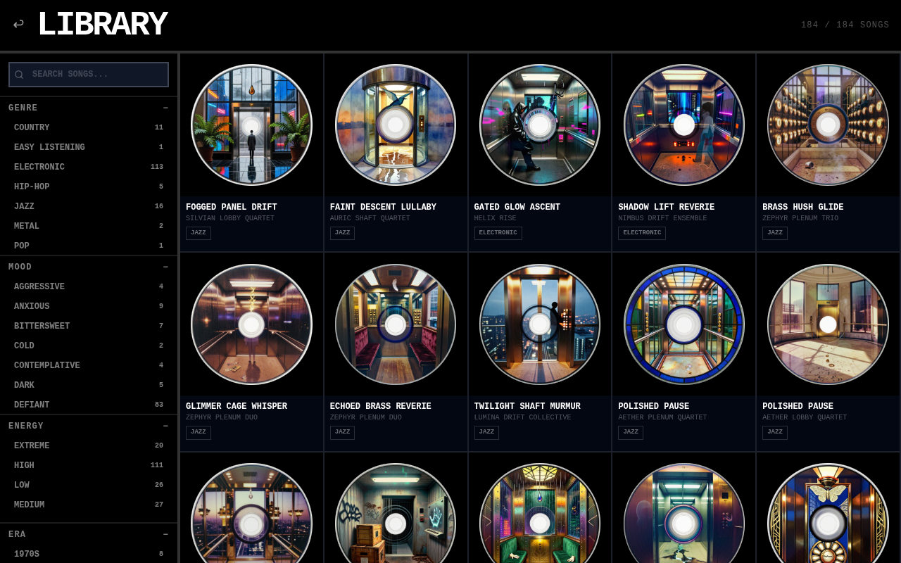
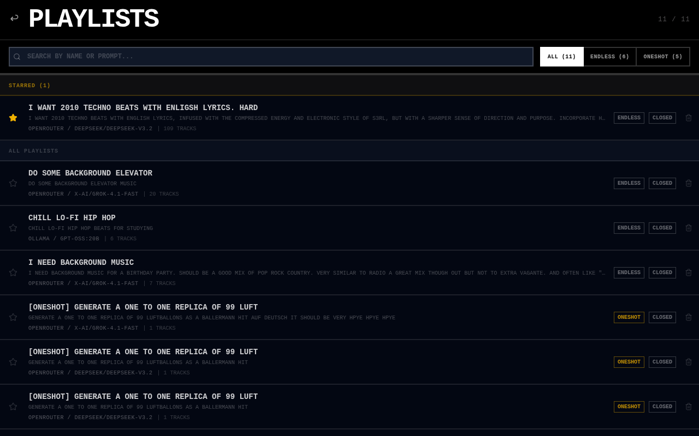
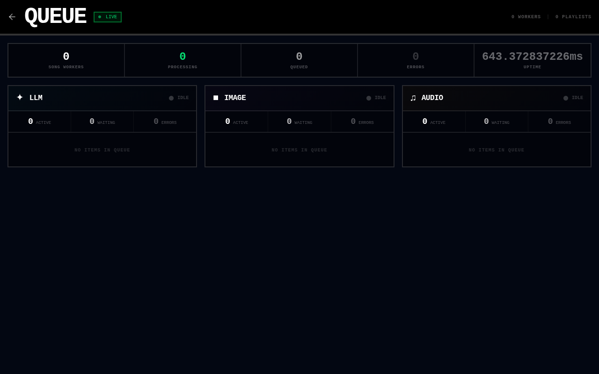
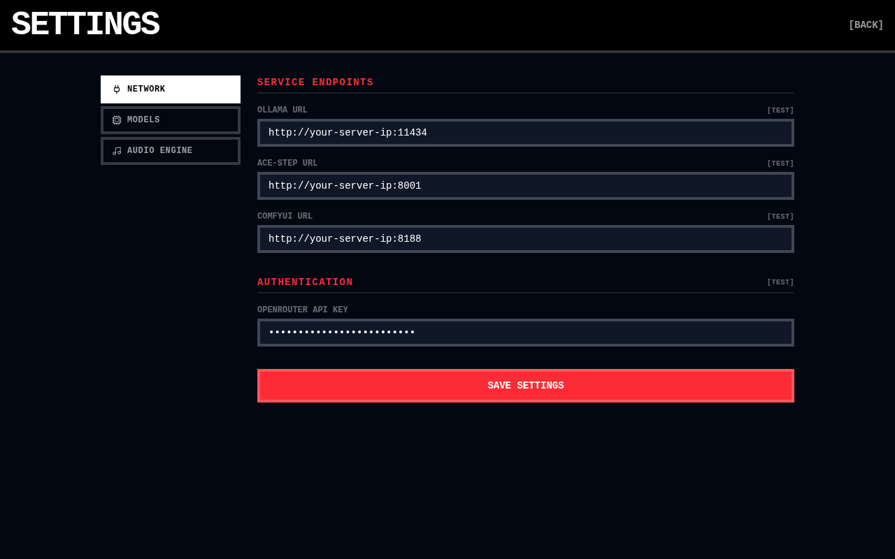
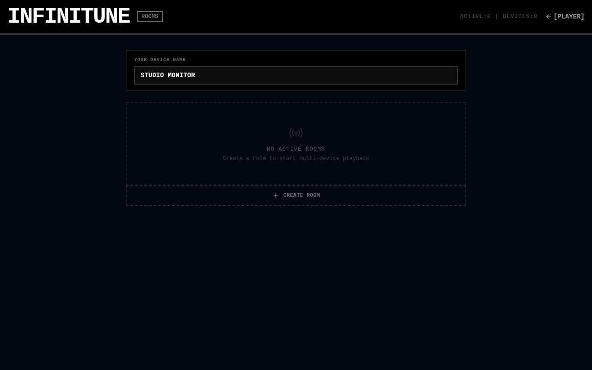

<div align="center">

<br>

# INFINITUNE

### Infinite Generative Music

**Describe a vibe. Get an endless stream of original AI-generated songs — lyrics, cover art, and audio, all created on the fly.**

<br>

[Features](#features) · [Screenshots](#screenshots) · [How It Works](#how-it-works) · [Tech Stack](#tech-stack) · [Quick Start](#quick-start) · [Architecture](#architecture)

<br>

</div>

## Features

- **Endless Generation** — describe a mood, genre, or artist and songs keep appearing in real-time
- **Prompt Steering** — change direction mid-stream without losing history
- **One-Off Requests** — drop in a specific song idea and it gets generated next
- **Album Mode** — generate an entire album from a single track
- **Oneshot Mode** — generate a single standalone song with full control
- **Song Library** — browse all generated songs with genre, mood, energy, and era filters
- **Playlist Management** — star favorites, search, filter by mode (endless/oneshot)
- **Multi-Device Rooms** — synchronized playback across devices (Sonos-style)
- **Gapless Playback** — next song preloads in background, zero gaps between tracks
- **Rating & Feedback** — thumbs up/down to influence future generation
- **Cover Art** — AI-generated vinyl-style album covers for every song
- **Configurable AI** — switch between local (Ollama) and cloud (OpenRouter) LLMs on the fly

## Screenshots

### Player View
The main player with now-playing display, generation controls, prompt steering, and the song queue.

<div align="center">

</div>

### Song Library
Browse all generated songs with cover art. Filter by genre, mood, energy level, and era.

<div align="center">

</div>

### Playlist Management
Star your favorites, search by name or prompt, filter by endless or oneshot mode.

<div align="center">

</div>

### Landing Page
Describe your music, pick a provider and model, and start listening.

<div align="center">

</div>

### Oneshot Mode
Generate a single standalone song with full prompt control and advanced settings.

<div align="center">

</div>

### Worker Queue
Live dashboard showing LLM, image, and audio pipeline status with active/waiting/error counts.

<div align="center">

</div>

<details>
<summary><strong>More screenshots</strong></summary>

#### Settings
Configure service endpoints (Ollama, ACE-Step, ComfyUI), API keys, and model preferences.

<div align="center">

</div>

#### Rooms
Create rooms for synchronized multi-device playback. Name your devices, join as player or controller.

<div align="center">

</div>

</details>

## How It Works

> **1.** Describe your music — *"2010 techno beats with English lyrics, S3RL energy, heavy 808 bass"*
>
> **2.** Hit Start — a background worker kicks off the pipeline: LLM writes metadata + lyrics, ComfyUI renders cover art, ACE-Step synthesizes audio
>
> **3.** Listen endlessly — songs appear in real-time. Rate them up/down to steer the direction. Request one-offs or generate entire albums from a single track.

### Song Generation Pipeline

Each song flows through: `pending` → `generating_metadata` → `metadata_ready` → `submitting_to_ace` → `generating_audio` → `saving` → `ready` → `played`

The worker spawns a per-song worker with concurrency queues managing throughput across three lanes: **LLM** (metadata/lyrics), **Image** (cover art), and **Audio** (ACE-Step synthesis).

### Multi-Device Playback

Infinitune includes an integrated **Room Server** for synchronized playback — think Sonos or Spotify Connect, but for AI-generated music.

- **Roles** — devices join as **player** (outputs audio) or **controller** (remote control only)
- **Sync** — all players stay locked to the same song and position
- **Per-device control** — adjust volume or pause individual players independently
- **Clock sync** — NTP-style ping/pong calibration, synchronized within ~50ms across LAN
- **Gapless** — next song preloads in background while current one plays

## Tech Stack

| | Technology |
|:--|:-----------|
| **Frontend** | React 19 · TanStack Router · React Query · Tailwind CSS 4 |
| **Backend** | Hono (unified server — API + worker + rooms on one port) |
| **Database** | SQLite (better-sqlite3, WAL mode) · Drizzle ORM |
| **Room Server** | Integrated WebSocket server · multi-device sync · REST API |
| **Worker** | Event-driven background pipeline · per-song workers · concurrency queues |
| **Audio** | ACE-Step 1.5 (text-to-music synthesis) |
| **Cover Art** | ComfyUI (image generation) |
| **LLM** | Vercel AI SDK · Ollama (local) or OpenRouter (cloud) |
| **Build** | Vite 7 · TypeScript 5.7 · Biome (lint/format) · pnpm monorepo |

## Quick Start

```bash
# Install dependencies
pnpm install

# Start everything (web + unified server)
pnpm dev:all
```

> The web dev server runs on `:5173`, the unified backend on `:5175`. Create an `apps/web/.env.local` with `VITE_API_URL=http://localhost:5175` for local dev.

### Prerequisites

Infinitune requires external AI services running on your network:

| Service | Role | Default Port |
|:--------|:-----|:-------------|
| **ACE-Step 1.5** | Text-to-music synthesis | `:8001` |
| **Ollama** | Local LLM (metadata, lyrics) | `:11434` |
| **ComfyUI** | Cover art generation | `:8188` |
| **OpenRouter** *(optional)* | Cloud LLM access | — |

### Environment Variables

Configure in `apps/server/.env.local`:

```env
# AI service endpoints (replace with your server addresses)
OLLAMA_URL=http://<your-server>:11434
ACE_STEP_URL=http://<your-server>:8001
COMFYUI_URL=http://<your-server>:8188

# Optional — cloud LLM via OpenRouter
OPENROUTER_API_KEY=sk-or-v1-...

# Where to store generated audio files
MUSIC_STORAGE_PATH=/path/to/your/music/storage
```

## Architecture

```
Browser (React 19 + TanStack Router + React Query)
  ↕ HTTP fetch + WebSocket event invalidation (/ws)
  ↕ WebSocket room protocol (/ws/room)
Unified Server (Hono on :5175)
  ├── SQLite (better-sqlite3, WAL mode)
  ├── In-memory typed event bus
  ├── Service layer (song, playlist, settings)
  ├── Event-driven worker (metadata → cover → audio pipeline)
  ├── Room manager (multi-device playback)
  ├── WebSocket bridge → Browser (event invalidation)
  └── External services:
      ├── LLM (Ollama/OpenRouter via Vercel AI SDK)
      ├── ComfyUI → cover art
      └── ACE-Step 1.5 → audio synthesis
```

**One server process** handles everything: API routes, worker pipeline, room management, event broadcasting. No message queues. No inter-process HTTP. Single port.

**Event-driven:** Service mutations emit events → worker handlers react instantly → no polling. Song completion triggers buffer deficit check → creates new pending songs → triggers metadata generation → self-sustaining loop.

### Project Structure

```
infinitune/
  packages/
    shared/            # @infinitune/shared — types, protocol, pick-next-song
    room-client/       # @infinitune/room-client — room hooks
  apps/
    web/               # React frontend (Vite + TanStack)
    server/            # Unified backend (Hono — API + worker + rooms)
```

<div align="center">
<sub>Built with mass GPU cycles and human curiosity.</sub>
</div>
