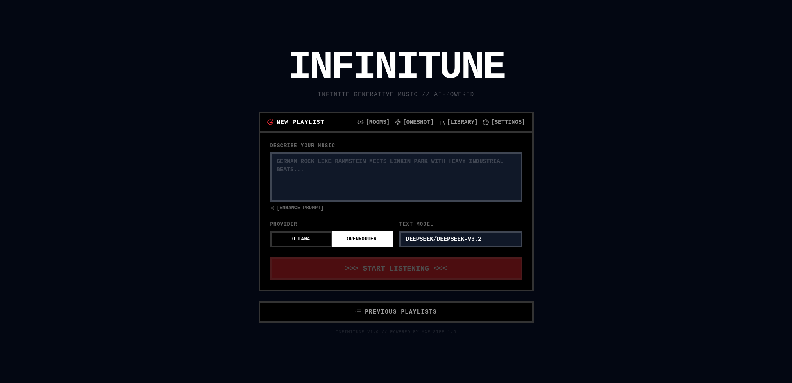
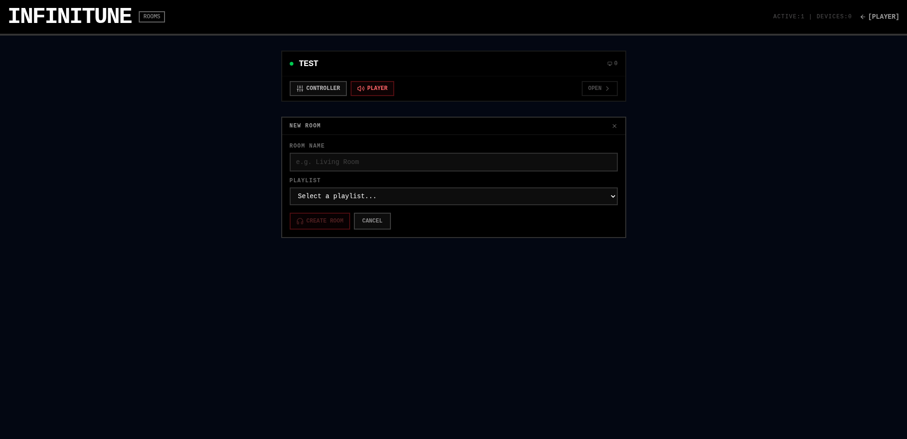
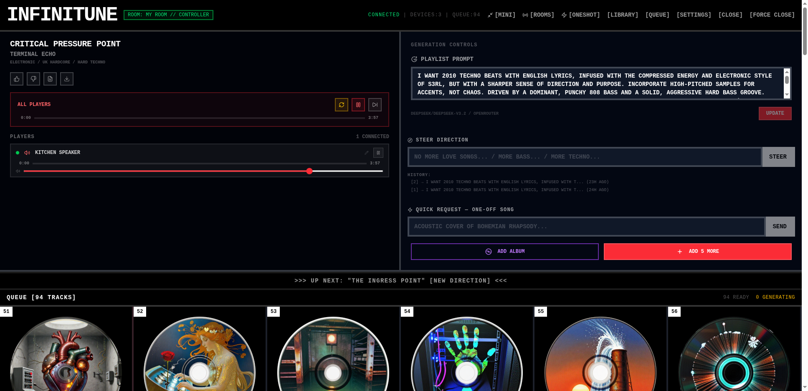

<div align="center">

<br>

# ∞ INFINITUNE

### Infinite Generative Music

**Describe a vibe. Get an endless stream of original AI-generated songs — lyrics, cover art, and audio, all created on the fly.**

<br>


<br>

[How It Works](#how-it-works) · [Multi-Device Playback](#multi-device-playback) · [Tech Stack](#tech-stack) · [Quick Start](#quick-start) · [Architecture](#architecture)

<br>

</div>

## Screenshots

<table>
<tr>
<td width="50%">

**Playlist Creator** — describe your music, pick a provider, hit start



</td>
<td width="50%">

**Queue Grid** — vinyl covers generated per-song by ComfyUI


</td>
</tr>
<tr>
<td width="50%">

**Rooms** — create rooms, link playlists, join as player or controller



</td>
<td width="50%">

**Room Controller** — per-device volume, play/pause, seek, and device renaming



</td>
</tr>
</table>

## How It Works

> **1.** Describe your music — *"2010 techno beats with English lyrics, S3RL energy, heavy 808 bass"*
>
> **2.** Hit Start — a background worker kicks off the pipeline: LLM writes metadata + lyrics → ComfyUI renders cover art → ACE-Step synthesizes audio
>
> **3.** Listen endlessly — songs appear in real-time. Rate them 👍/👎 to steer the direction. Request one-offs or generate entire albums from a single track.

## Multi-Device Playback

Infinitune includes a **Room Server** for synchronized multi-device playback — think Sonos or Spotify Connect, but for AI-generated music.

> **1.** Go to **[ROOMS]** and create a room linked to any active playlist
>
> **2.** Open the room on multiple devices — each joins as a **player** (outputs audio) or **controller** (remote control only)
>
> **3.** All players in a room stay in sync — same song, same position. Controllers see real-time playback state and can play/pause, skip, seek, or adjust volume across all devices at once.

**Per-device control:** Adjust volume or pause individual players independently. Devices in "individual" mode ignore room-wide changes until explicitly synced back. Rename devices for easy identification (e.g. "Kitchen Speaker", "Office").

**Gapless playback:** The next song is preloaded in the background while the current one plays — no gaps between tracks.

**Clock sync:** Devices calibrate against the server clock on connect (NTP-style ping/pong), so synchronized play commands land within ~50ms across the LAN.

## Hardware Setup

Infinitune runs on a **Framework Desktop** (AMD Ryzen / dedicated GPU) hosting all AI services locally on the same network:

| Service | Role | Details |
|:--------|:-----|:--------|
| **ACE-Step 1.5** | 🎵 Audio | Text-to-music model — generates full songs from lyrics + captions |
| **Ollama** | 🧠 Local LLM | Llama 3.1, DeepSeek, etc. for song metadata, lyrics, persona extraction |
| **OpenRouter** | ☁️ Cloud LLM | Optional — access DeepSeek, Claude, GPT via API |
| **ComfyUI** | 🎨 Cover Art | Generates vinyl-style album covers from image prompts |
| **Convex** | ⚡ Real-time DB | Syncs playlist state between browser, worker, and all clients |

## Tech Stack

| | Technology |
|:--|:-----------|
| **Frontend** | React 19 · TanStack Router · Tailwind CSS 4 |
| **Backend** | Convex (real-time database + mutations/queries) |
| **Room Server** | Node.js WebSocket server · multi-device sync · REST API |
| **Worker** | Node.js background process · per-song workers · endpoint queues |
| **Audio** | ACE-Step 1.5 (text-to-music synthesis) |
| **Cover Art** | ComfyUI (image generation) |
| **LLM** | Ollama (local) or OpenRouter (cloud) |
| **Build** | Vite 7 · TypeScript 5.7 · Biome (lint/format) |

## Quick Start

```bash
# Install dependencies
pnpm install

# Start Convex backend
npx convex dev

# Start dev server
pnpm dev

# Start the generation worker
pnpm worker
```

> All three processes need to run simultaneously. Or use `pnpm dev:all` to start everything at once (including the room server).
>
> For multi-device playback, the room server runs on `:5174` — start it separately with `pnpm room-server` or use `pnpm dev:all`.

## Environment Variables

Configure in `.env.local`:

| Variable | Default | Description |
|:---------|:--------|:------------|
| `VITE_CONVEX_URL` | — | Convex deployment URL *(required)* |
| `OLLAMA_URL` | `http://192.168.10.120:11434` | Ollama API endpoint |
| `ACE_STEP_URL` | `http://192.168.10.120:8001` | ACE-Step audio generation endpoint |
| `COMFYUI_URL` | `http://192.168.10.120:8188` | ComfyUI image generation endpoint |
| `OPENROUTER_API_KEY` | — | OpenRouter API key *(if using cloud LLM)* |
| `MUSIC_STORAGE_PATH` | `/mnt/truenas/MediaBiB/media/AI-Music` | Path for storing generated audio files |
| `ACE_NAS_PREFIX` | — | NAS path prefix for ACE-Step output |

## Architecture

```
Browser (React + TanStack Router)
  ↕ real-time subscriptions (useQuery)
Convex (database + mutations/queries)
  ↕ HTTP polling              ↕ HTTP polling (~2s)
Worker (Node.js)          Room Server (Node.js :5174)
  ├── LLM → metadata          ↕ WebSocket (device sync)
  ├── ComfyUI → cover art     ├── room state machine
  └── ACE-Step → audio        ├── per-device mode control
                               └── REST API (/api/v1/rooms)
```

**Song generation:** The frontend creates playlists and displays songs in real-time. The worker polls Convex for pending songs, orchestrates the generation pipeline (LLM → cover art → audio), and writes results back. Convex's real-time subscriptions push updates to the browser instantly.

**Multi-device playback:** The Room Server runs alongside the main app. It polls Convex for song queues, manages room state (playback position, volume, device list), and pushes updates to connected devices over WebSocket. Devices join as **players** (audio output) or **controllers** (remote control). The server handles synchronized start times, per-device volume/mode overrides, and gapless song transitions. The worker is completely unaware of rooms — it keeps generating songs into Convex as usual.

## Project Structure

```
src/
  routes/          # File-based routes + API endpoints
  components/      # React components (autoplayer/, ui/, mini-player/)
  services/        # LLM, ACE-Step, cover art integrations
  hooks/           # Custom React hooks (incl. room hooks)
  lib/             # Utilities + player store
convex/            # Database schema, mutations, queries
worker/            # Background song generation worker
room-server/       # Multi-device playback server (WebSocket + REST)
```

<div align="center">
<sub>Built with mass GPU cycles and human curiosity.</sub>
</div>
