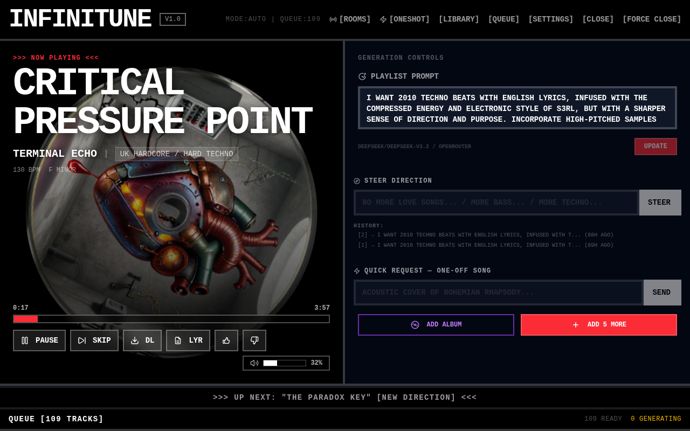
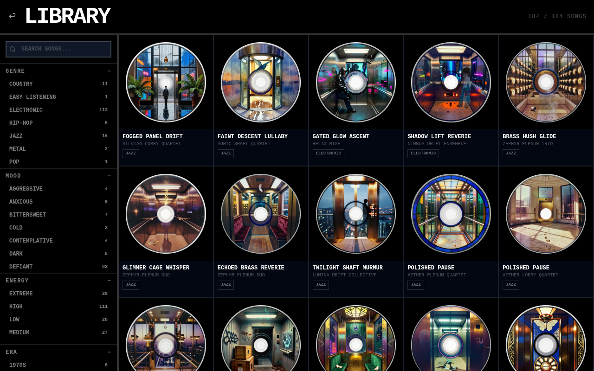
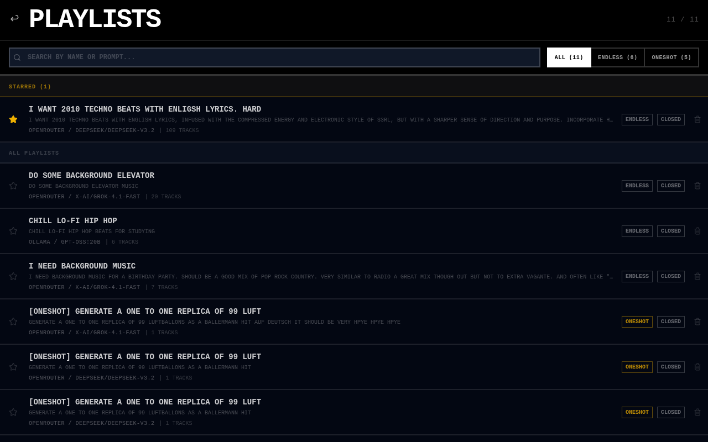
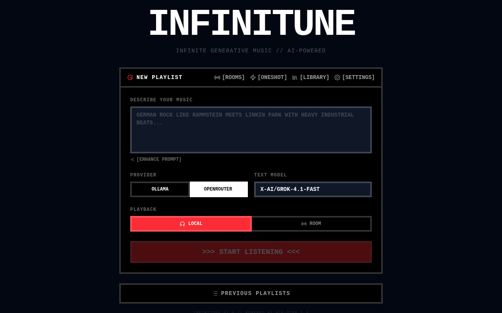
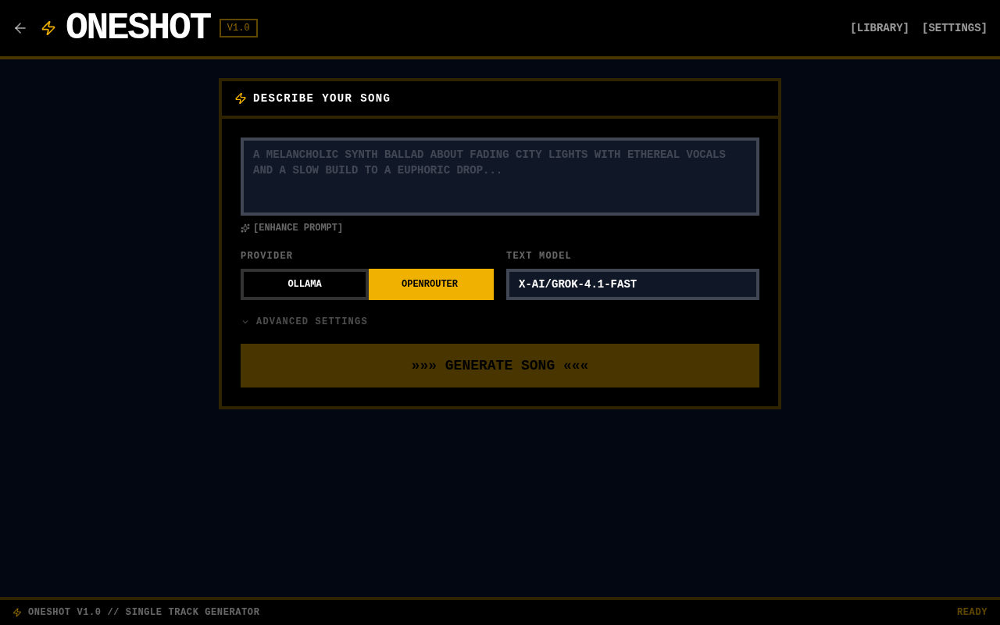
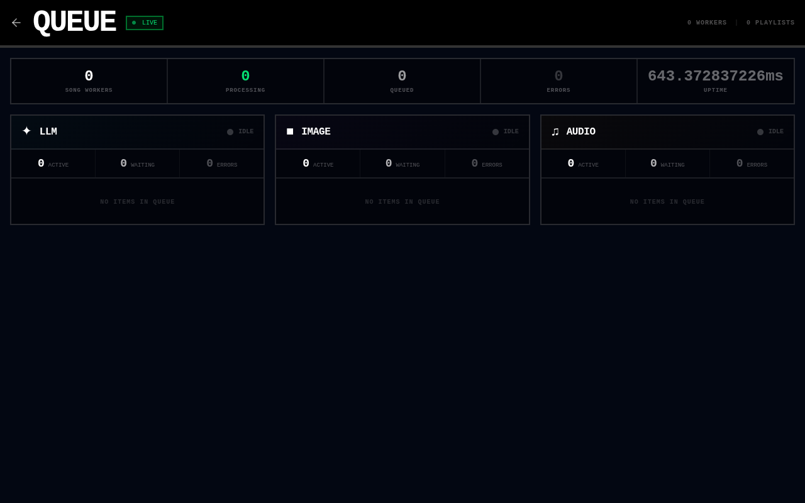
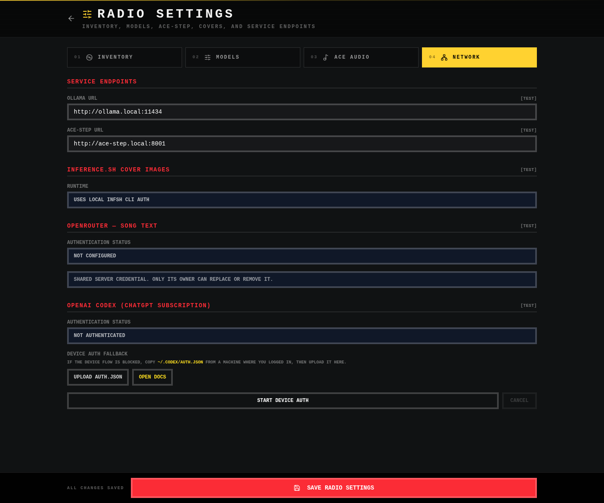
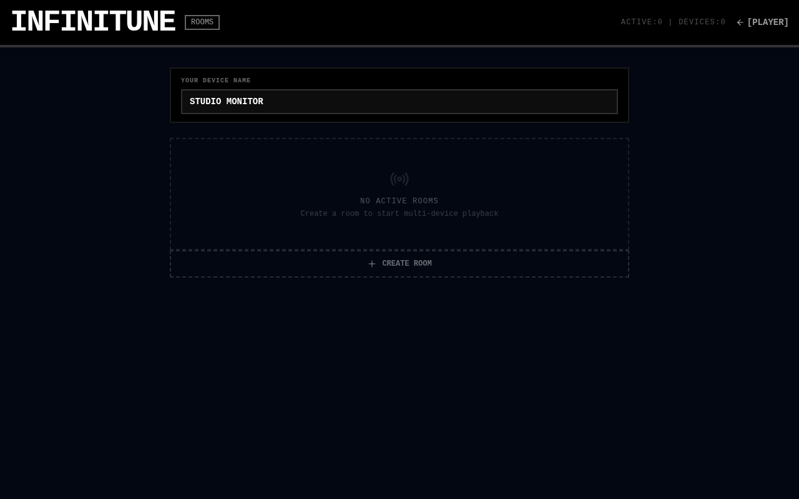

<div align="center">

<br>

# INFINITUNE

### Infinite Generative Music

**Describe a vibe. Get an endless stream of original AI-generated songs — lyrics, cover art, and audio, all created on the fly.**

<br>

[Features](#features) · [Screenshots](#screenshots) · [How It Works](#how-it-works) · [Tech Stack](#tech-stack) · [Quick Start](#quick-start) · [Architecture](#architecture)

<br>

</div>

## Features

- **Endless Generation** — describe a mood, genre, or artist and songs keep appearing in real-time
- **Prompt Steering** — change direction mid-stream without losing history
- **One-Off Requests** — drop in a specific song idea and it gets generated next
- **Album Mode** — generate an entire album from a single track
- **Oneshot Mode** — generate a single standalone song with full control
- **Song Library** — browse all generated songs with genre, mood, energy, and era filters
- **Playlist Management** — star favorites, search, filter by mode (endless/oneshot)
- **Multi-Device Rooms** — synchronized playback across devices (Sonos-style)
- **Terminal Daemon Control** — run local playback as a background daemon and control it with `infi` commands
- **Gapless Playback** — next song preloads in background, zero gaps between tracks
- **Rating & Feedback** — thumbs up/down to influence future generation
- **Cover Art** — AI-generated vinyl-style album covers for every song
- **Exact Cover Lyrics** — match identified source tracks through LRCLIB and verify the audio duration before generation
- **Share Links** — publish revocable permanent or timed links without exposing private playlist controls
- **Global Radio** — run one synchronized station and switch the genre and vocal preset used for future albums
- **Configurable AI** — choose OpenRouter or OpenAI Codex (ChatGPT subscription) for lyrics and metadata

## Screenshots

### Player View
The main player with now-playing display, generation controls, prompt steering, and the song queue.

<div align="center">

</div>

### Song Library
Browse all generated songs with cover art. Filter by genre, mood, energy level, and era.

<div align="center">

</div>

### Playlist Management
Star your favorites, search by name or prompt, filter by endless or oneshot mode.

<div align="center">

</div>

### Landing Page
Describe your music, pick a provider and model, and start listening.

<div align="center">

</div>

### Oneshot Mode
Generate a single standalone song with full prompt control and advanced settings.

<div align="center">

</div>

### Worker Queue
Live dashboard showing LLM, image, and audio pipeline status with active/waiting/error counts.

<div align="center">

</div>

<details>
<summary><strong>More screenshots</strong></summary>

#### Settings
Configure AI runtimes and service endpoints (Ollama, ACE-Step, Inference.sh), API keys, model preferences, and ACE-Step audio defaults.

<div align="center">

</div>

#### Rooms
Create rooms for synchronized multi-device playback. Name your devices, join as player or controller.

<div align="center">

</div>

</details>

## How It Works

> **1.** Describe your music — *"2010 techno beats with English lyrics, S3RL energy, heavy 808 bass"*
>
> **2.** Hit Start — the unified backend kicks off the pipeline: LLM writes metadata + lyrics, Inference.sh renders cover art, ACE-Step synthesizes audio
>
> **3.** Listen endlessly — songs appear in real-time. Rate them up/down to steer the direction. Request one-offs or generate entire albums from a single track.

### Song Generation Pipeline

Each song flows through: `pending` → `generating_metadata` → `metadata_ready` → `submitting_to_ace` → `generating_audio` → `saving` → `ready` → `played`

The unified server runs a per-song worker pipeline with concurrency queues managing throughput across three lanes: **LLM** (metadata/lyrics), **Image** (cover art), and **Audio** (ACE-Step synthesis).

ACE queue depth is the number of submitted tasks Infinitune keeps in ACE-Step's
backlog; it does not create ACE workers or guarantee parallel synthesis. Match
the depth to the worker capacity configured in ACE-Step when responsive
prioritization matters.

### Multi-Device Playback

Infinitune includes integrated room management for synchronized playback — think Sonos or Spotify Connect, but for AI-generated music.

- **Roles** — devices join as **player** (outputs audio) or **controller** (remote control only)
- **Sync** — all players stay locked to the same song and position
- **Per-device control** — adjust volume or pause individual players independently
- **Clock sync** — NTP-style ping/pong calibration, synchronized within ~50ms across LAN
- **Gapless** — next song preloads in background while current one plays

### Terminal Daemon (`infi`)

Use the terminal daemon when you want room playback without keeping the browser open.

```bash
# Start daemon manually
pnpm infi daemon start

# Pick playlist + play (auto-creates room when needed)
pnpm infi play

# Playback controls
pnpm infi stop
pnpm infi skip
pnpm infi volume up
pnpm infi volume down --step 0.1
pnpm infi mute

# Interactive selectors
pnpm infi room pick
pnpm infi song pick

# Status
pnpm infi status

# Persist CLI defaults (server/device/step)
pnpm infi config --server http://localhost:5175
pnpm infi config --device-name "DESK SPEAKER"
pnpm infi config --daemon-host 127.0.0.1 --daemon-port 17653
pnpm infi config

# Daemon HTTP endpoints (for Waybar/custom scripts)
curl -s http://127.0.0.1:17653/status | jq
curl -s http://127.0.0.1:17653/queue | jq
curl -s http://127.0.0.1:17653/waybar | jq
```

Install a local command wrapper:

```bash
pnpm infi install-cli
```

Install the CLI man page:

```bash
pnpm infi install-man
```

Then use:

```bash
infi play
infi stop
infi man
man infi
```

Install daemon as a systemd user service:

```bash
pnpm infi service install
pnpm infi service restart
pnpm infi service uninstall
```

## Tech Stack

| | Technology |
|:--|:-----------|
| **Frontend** | React 19 · TanStack Router · React Query · Tailwind CSS 4 |
| **Backend** | Hono (unified server — API + worker + rooms on one port) |
| **Database** | SQLite (better-sqlite3, WAL mode) · Drizzle ORM |
| **Rooms** | Integrated WebSocket room service · multi-device sync · REST API |
| **Worker Pipeline** | Event-driven background pipeline · per-song workers · concurrency queues |
| **Audio** | ACE-Step 1.5 (text-to-music synthesis) |
| **Cover Art** | Inference.sh (image generation) |
| **LLM** | Pi AI runtime with OpenRouter API-key auth or OpenAI Codex through a ChatGPT subscription |
| **Build** | Vite 7 · TypeScript 5.7 · Biome (lint/format) · pnpm monorepo |

## Quick Start

```bash
# Install dependencies
pnpm install

# Start everything (web + unified server) with Portless stable local domains
pnpm dev

# Fixed-port fallback (Vite :5173, server :5175)
pnpm dev:all:fallback
```

> Default local dev uses Portless: web at `https://web-infinitune.localhost:1355`, backend API at `https://api-infinitune.localhost:1355`, with `VITE_API_URL` and `APP_ORIGIN` set automatically by scripts.
> Fallback mode: use `pnpm dev:all:fallback` to run web on `:5173` and the unified backend on `:5175` (`VITE_API_URL=http://localhost:5175`).
> Backend-only local dev should use `pnpm dev:server`; `pnpm server` is a pnpm built-in command name, not a reliable script entry point.

### T3Code Worktrees

Set T3Code's "Run automatically on worktree creation" command to:

```bash
bash scripts/t3code-worktree-setup.sh
```

### Prerequisites

Infinitune requires external AI services running on your network:

| Service | Role | Default Port |
|:--------|:-----|:-------------|
| **ACE-Step 1.5** | Text-to-music synthesis | `:8001` |
| **Inference.sh CLI** | Cover art generation (bundled in the container; install locally for development) | local CLI |
| **LRCLIB** *(optional)* | Exact lyrics for identified cover sources | HTTPS |
| **OpenRouter** *(optional)* | Cloud LLM access | — |
| **Codex CLI** *(optional)* | OpenAI Codex provider bridge (`codex app-server`) | — |

The default ACE-Step profile is Preset M: `acestep-v15-xl-sft`, 50 inference steps, Heun sampling, ODE inference, CFG 7, Shift 1, Velocity Clamp 2, and Velocity EMA 0.1. Thinking, ADG, and DCW are off. You can change every value in Settings. XL models need more VRAM, so choose a smaller model on hosts that cannot load XL SFT. Alternate VAEs remain ACE service settings; set `ACESTEP_VAE_CHECKPOINT=scragvae` or a custom checkpoint or path on the ACE-Step server to match the app setting.

### Environment Variables

Configure in `apps/server/.env.local`:

```env
# ACE-Step lazy-load service on the Windows generation host
ACE_STEP_URL=http://192.168.10.242:8001

# Optional — cloud LLM via OpenRouter
OPENROUTER_API_KEY=sk-or-v1-...

# Persist UI-saved Pi/OpenRouter credentials on the mounted data volume
INFINITUNE_PI_AGENT_DIR=/app/data/.infinitune/pi

# Optional — public LRCLIB instance used for exact cover lyrics
LRCLIB_URL=https://lrclib.net

# Optional downloaded cover-source cache bounds (defaults: 1 GiB / 168 hours).
# The byte limit is clamped to 200 MiB + 64 KiB for one safe transcode slot.
REIMAGINE_CACHE_MAX_BYTES=1073741824
REIMAGINE_CACHE_TTL_HOURS=168

# Optional Pangolin identity headers. Leave false unless the proxy boundary
# described below is enforced for both the web and server processes.
INFINITUNE_TRUST_PANGOLIN_HEADERS=false

# Optional — override Codex turn timeout (default: 360000 / 6 minutes)
CODEX_TURN_TIMEOUT_MS=360000

# Where to store generated audio files
MUSIC_STORAGE_PATH=/path/to/your/music/storage

# Required for SSR share pages and reverse proxies: comma-separated IPs or
# CIDRs for the frontend server and proxy hops allowed to supply X-Forwarded-For.
RATE_LIMIT_TRUSTED_PROXY_IPS=127.0.0.1,10.42.0.0/16

# Optional public-share read cap per client and minute (default: 120)
RATE_LIMIT_SHARE_READS_PER_MIN=120

# Optional global backstops for routes that can spend external compute.
# These remain effective when clients rotate source addresses.
RATE_LIMIT_GENERATION_GLOBAL_PER_MIN=100
RATE_LIMIT_LLM_GLOBAL_PER_MIN=200
RATE_LIMIT_RADIO_REQUESTS_GLOBAL_PER_MIN=50
```

Every production frontend and server process requires `APP_ORIGIN`. Set it to
the public web origin, such as `https://music.example.com`, even when the
frontend and API share one public origin. The container entrypoint refuses to
start either process when it is missing or is not an absolute HTTP(S) origin.
You may also set `INTERNAL_API_URL` on the frontend process to a private backend
origin, such as
`http://infinitune-api:5175`; it is used only for server-side API fetches.
Rendered cover and audio URLs always use the public `APP_ORIGIN`. Browser
requests remain same-origin when production builds leave `VITE_API_URL` empty.

Set `RATE_LIMIT_TRUSTED_PROXY_IPS` for every standard deployment because the SSR
share loader forwards client addresses to the API. The list must include the
frontend container or network and every trusted reverse-proxy hop. Configure
the edge proxy to overwrite `X-Forwarded-For`. Infinitune walks that chain from
the right and uses the first untrusted address as the client. Requests containing
`X-Forwarded-For` are rejected with 503 when no trust list is configured, and
the production server refuses to start without one. Do not expose the frontend
without an edge proxy that is responsible for overwriting `X-Forwarded-For`.
Infinitune ignores `X-Real-IP` for rate limiting.

Pangolin deployments that do not issue a Shoo token to the browser can set
`INFINITUNE_TRUST_PANGOLIN_HEADERS=true` in both the web and server processes.
Infinitune then accepts Pangolin's `Remote-User-Id` header as the user identity;
`Remote-Email` and `Remote-Name` are optional. Enable this only when Pangolin is
the sole reachable upstream, the edge proxy removes or overwrites incoming
`Remote-*` headers, and network rules block direct access to the frontend,
backend, and load balancer. A reachable direct path would let a client forge
these headers.

Authenticated owners can create permanent or timed share links. A permanent link
for temporary music promotes its playlist by clearing the cleanup expiry. Later
revocation does not make that playlist temporary again because the service cannot
safely reconstruct the original cleanup deadline. Timed owner links extend a
temporary playlist only to the link expiry.

Ownerless music receives a server-forced share expiry of at most 24 hours. If the
music has an earlier cleanup deadline, the link uses that deadline and never
extends or disables cleanup. Anonymous users cannot list or revoke these links
because the service has no anonymous identity to prove who created the link.

Revoking or expiring a link removes access to its shared page and public
metadata. Audio delivery keeps Infinitune's existing public-by-song-ID contract
so native browser media elements, downloads, and room playback work without an
authorization header. A shared song ID does not grant access to private metadata
or mutations, but audio that a recipient has already opened or downloaded cannot
be revoked.

### OpenRouter setup

Use OpenRouter when you want to choose from its text-model catalog for song metadata, lyrics, prompt enhancement, and persona extraction.

1. Open `Settings` → `Network` → `OPENROUTER — SONG TEXT`.
2. Paste an OpenRouter API key and click `SAVE KEY`. Infinitune stores the key in Pi's protected auth file and never returns it to the browser.
3. Click `TEST` if you want to validate the saved credential.
4. Open `Settings` → `Models`, select `OPENROUTER`, and choose a model. `auto` is the default.

You can also set `OPENROUTER_API_KEY` on the server instead of saving a key in the UI. Radio planning and song generation use the selected global text provider and model.

On the first start of this release, Infinitune resets OpenRouter selections
saved by older versions to OpenAI Codex. This prevents existing ownerless jobs
from silently starting billed OpenRouter work. Save the key, then select
OpenRouter again for the global text profile or create a new owned playlist.

For a cover whose source title and artist are known, Infinitune asks LRCLIB for
`plainLyrics` after resolving the reference audio. It accepts only an exact
title/artist match whose duration differs by no more than two seconds. If
LRCLIB is unavailable or has no exact match, generation keeps the existing
fallback lyrics. In `Reimagine` URL mode, fill in both original-track fields
to enable the lookup; explicitly pasted lyrics always take priority. If no
exact duration match exists, Infinitune stops before creating the cover job and
asks you to correct the source identity or paste lyrics.

### OpenAI Codex (ChatGPT Subscription) setup

Use this when you want LLM generation to run through your ChatGPT subscription instead of API-key billing.

1. Install the Codex CLI and verify it is on your `PATH` (`codex --version`).
2. Open `Settings` → `Network` → `OPENAI CODEX (CHATGPT SUBSCRIPTION)`.
3. Click `START DEVICE AUTH`, open the verification URL, and enter the one-time code.
4. Wait for status `Authenticated with ChatGPT`.
5. Pick `OPENAI CODEX` as provider in playlist creation or oneshot mode, then select a Codex model.

Notes:
- Text completion runs through the Pi AI runtime. The Codex CLI supplies ChatGPT authentication and model discovery.
- `openai-codex` covers text generation (metadata, lyrics, persona). Cover art and audio use Inference.sh + ACE-Step.

### Playlist Lifecycle

- Endless playlists move from `active` → `closing` after ~90s without heartbeat.
- Opening an endless playlist page sends heartbeat and now reactivates both `closing` and `closed` playlists, then refills the song buffer.
- Oneshot playlists remain closed after completion and are not auto-reactivated by heartbeat.

## Architecture

```
Browser (React 19 + TanStack Router + React Query)
  ↕ HTTP fetch + WebSocket event invalidation (/ws)
  ↕ WebSocket room protocol (/ws/room)
Unified Server (Hono on :5175)
  ├── SQLite (better-sqlite3, WAL mode)
  ├── In-memory typed event bus
  ├── Service layer (song, playlist, settings)
  ├── Event-driven worker (metadata → cover → audio pipeline)
  ├── Room manager (multi-device playback)
  ├── WebSocket bridge → Browser (event invalidation)
  └── External services:
      ├── LLM (OpenRouter or OpenAI Codex through the Pi AI runtime)
      ├── Inference.sh → cover art
      └── ACE-Step 1.5 → audio synthesis
```

**One server process** handles everything: API routes, worker pipeline, room management, event broadcasting. No message queues. No inter-process HTTP. Single port.

**Event-driven:** Service mutations emit events → worker handlers react instantly → no polling. Song completion triggers buffer deficit check → creates new pending songs → triggers metadata generation → self-sustaining loop.

### Project Structure

```
infinitune/
  packages/
    shared/            # @infinitune/shared — types, protocol, pick-next-song
    room-client/       # @infinitune/room-client — room hooks
  apps/
    web/               # React frontend (Vite + TanStack)
    server/            # Unified backend (Hono — API + worker + rooms)
```

<div align="center">
<sub>Built with mass GPU cycles and human curiosity.</sub>
</div>
